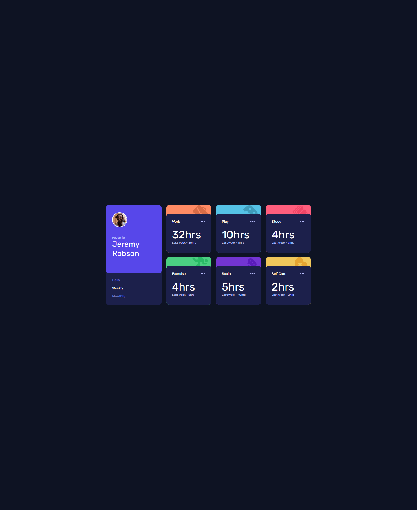

# Frontend Mentor - Time tracking dashboard solution

This is a solution to the [Time tracking dashboard challenge on Frontend Mentor](https://www.frontendmentor.io/challenges/time-tracking-dashboard-UIQ7167Jw). Frontend Mentor challenges help you improve your coding skills by building realistic projects.

## Table of contents

- [Overview](#overview)
  - [The challenge](#the-challenge)
  - [Screenshot](#screenshot)
  - [Links](#links)
- [My process](#my-process)
  - [Built with](#built-with)
  - [Useful resources](#useful-resources)
- [Author](#author)

## Overview

### The challenge

Users should be able to:

- View the optimal layout for the site depending on their device's screen size
- See hover states for all interactive elements on the page
- Switch between viewing Daily, Weekly, and Monthly stats

### Screenshot

### Links

- Solution URL: [Add solution URL here](https://olaide-hok.github.io/time-tracking-dashboard/)

## My process

### Built with

- Semantic HTML5 markup
- CSS custom properties
- Flexbox
- CSS Grid
- Mobile-first workflow
- Javascript

### Useful resources

- [Javascript](https://developer.mozilla.org/en-US/docs/Web/JavaScript) - This helped me with Javascript programming language. I really liked this resource and will use it going forward.
- [Working with JSON](https://developer.mozilla.org/en-US/docs/Learn_web_development/Core/Scripting/JSON) - This resource helped me to understand using JSON for transmitting data in web applications (e.g., sending some data from the server to the client, so it can be displayed on a web page, or vice versa).
- [Google Fonts](https://fonts.google.com/) - This helped me add the Rubik fonts.

## Author

- Website - [Habeeb Kareem](https://habeeb-dev.netlify.app)
- Frontend Mentor - [@olaide-hok](https://www.frontendmentor.io/profile/olaide-hok)
